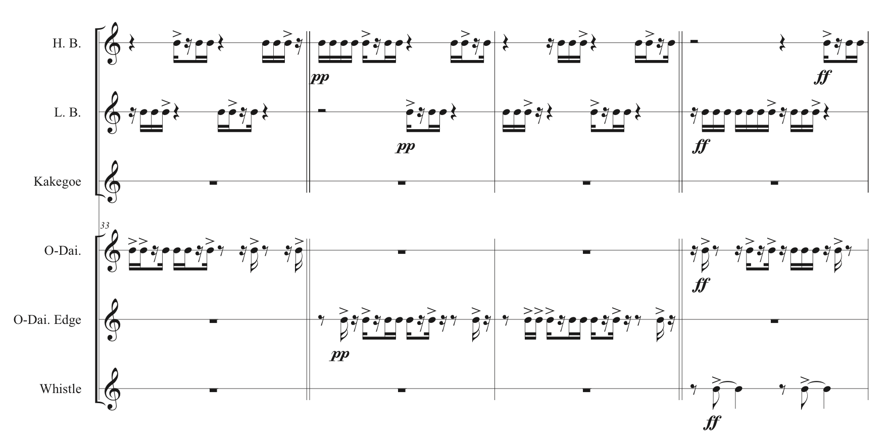

## Fall 2019 | Japanese Danjiri Rhythm Generator
Modularization and generation of rhythmic components in traditional Japanese [Danjiri](https://en.wikipedia.org/wiki/Danjiri_Matsuri) Festival music in Osaka

## Generated Music Sample (minimally human-intervened)

 
 

-----------------------------------------------

### Dev Notes (To Test) - Composition API
##### Class RhythmEvent - List of Methods
`toString()` \
`getIsSound()` \
`getIsAccented()`  \
`getNumberOfPulses()` \
`setIsSound(boolean _boolean)` \
`setIsAccented(boolean _boolean)` \
`copyAnotherRhythmEventIntoThis (RhythmEvent another)` \
`copyThisRhythmEvent()` \
`randomlyModifyAndReplace(int randomSeed)` \
`randomlyModifyAndCopy(int randomSeed)`

#### Class RhythmComposition - List of Methods
`saveThisCompositionToFile()` \
`changeTempoBetween(int toWhichTempo, int fromWhichPulse, int toWhichPulse)` \
`changeTempoFrom(int toWhichTempo, int fromWhichPulse)` \
`lineUpAllPartsWithHit()` \
`lineUpAllPartsWithAccent()` \
`lineUpAllPartsWithRest()` \
`lineUpAllPartsWithRandomRhythmEvent()` \
`printOutTotalTimeSoFarToTerminal()` 

#### Class RhythmPart - List of Methods
`addRhythmPattern(int numberOfPulses, int numberOfHits)` \
`addRhythmPattern(String nameOfRhythhmPattern)` \
`addRhythmPattern(String fileName, int choice)` \
`addRhythmPattern(RhythmPattern toAdd)` \
`addRhythmEvent(char rhythmEventChar)` \
`addRestPulses(int howMany)` \
`addRestPulses(RhythmPattern a)` - ArgumentのRhythmPatternのパルス数と同じ数だけのrestを足す 
`randomize1Gaussian(int fromWhichPulse, int toWhichPulse, int averageRandomFrequency)` \
`randomize2Gaussian(int fromWhichRhythmPattern, int toWhichRhythmPattern, int averageRandomFrequency)` 

#### Class RhythmPattern - List of Methods
`toString()` \
`saveRhythmPatternToFile()` \
`saveRhythmPatternToFile(String fileName)` \
`getThisRhythmPattern()` \
`copyThisRhythmPatternObject()` \
`getNumberOfPulses()` \
`getNumberOfHits()` \
`getNumberOfNonAccentedHits()` \
`getNumberOfAccents()` \
`getNumberOfRests()` \
`getIsthereHitAt()` \
`getIsThereAccentAt()` \
`getIsThereRestAt()` \
`getRhythmEventAt(int spot)` \
`isHitPatternROUT()` \
`isAccentPatternROUT()` \
`isRhythmPatternROUT()` \
`isHitPatternSymmetrical()` \
`isAccentPatternSymmetrical()` \
`isRhythmPatternSymmetrical()` \
`isHitPatternSymmetricalROUT()` \
`isRhythmPatternSymmetricalROUT()` \
`translateBooleanVectorIntoHitPattern(Vector<Boolean> booleanVector)` \
`translateHitPatternIntoBooleanVector()` \
`translateAccentPatternIntoBooleanVector()`   

##### Non-random Rhythm Modification Methods
`setRhythmEventAt(int atWhere, RhythmEvent rhythmEvent)` \
`setHitAt (int atWhere, boolean setToWhat)` \
`setAccentAt(int atWhere, boolean setToWhat)` \
`turnIntoRestAt (int atWhere)` \
`insertRhythmEventBeforeAnd` --> `(RhythmEvent rhythmEventToInsert, int beforeWhichSpot)` \
`insertRestPulseBeforeAnd` --> `(int beforeWhishSpot)` \
`insertRhythmEventAfterAnd` --> `( RhythmEvent, rhythmEventToInsert, int afterWhishSpot)` \
`insertRestPulseAfterAnd` --> `(int afterWhishSpot)` \
`addRestPulseAnd` --> `()` \
`addRhythmEventAnd` --> `(RhythmEvent rhythmEvent)` \
`insertRestPulseAtTheTopAnd` --> `()` \
`insertRhythmEventAtTheTopAnd` --> `(RhythmEvent rhythmEvent)` \
`removeRhythmEventAtAnd` --> `(int atWhichSpot)` \
`removeRhythmEventAtTheTopAnd` --> `()` \
`popRhythmEventAnd` --> `()` \
`convertAccentPatternIntoHitPatternAnd` --> `()` \
`switchHitsAndRestsAnd` --> `()` \
`rhythmicallyTranposeAnd` --> `(int transposeByHowMany)` \
`retrogradeAnd` --> `()`

<!--

TODO: to add in the future --- 
* Link to Sound Cloud (audio performance rendering)
* Link to Score PDF

-->